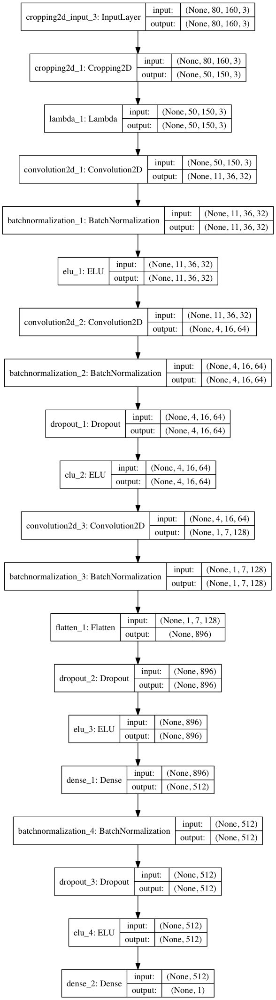

##Behavioral Cloning for Autonomous Driving

###Overview

The goal of this project is to train a Convolutional Neural Network built with [Keras](https://keras.io) to learn to drive a car around tracks in a simulator by mimicking human driving behavior via end-to-end learning, i.e. predicting steering angles directly from the image input of a single front-facing camera.

* model.py contains the script to create and train the model
* drive.py uses predictions from model.h5 to feed steering commands to the car in autonomous mode in the simulator available [here](github.com/udacity/self-driving-car-sim)
* model.h5 contains trained Keras model

Using the simulator linked above and the drive.py file, the car can drive autonomously around both available tracks by executing
```sh
python drive.py model.h5
```

The model only predicts steering angles - throttle, minimum and maximum speed are controlled by drive.py.

###Structure of model.py

The part of the model.py file that contains the code for creating, training and saving the Keras model starts in line 643. The lines before define a number of helper functions that are part of the overall training pipeline: An `assemble_filelists()` function to assemble lists of the available training data from the drive_log.csv file that the simulator creates when recording driving data, a `generate_batch()` generator function used by Keras' `fit_generator()` function to train the model, and a bunch of image transformation functions that are used by the generator to do ad-hoc data augmentation during training.

###Model Architecture

Initially I trained two different promising architectures to see if I was able to measure a significant difference in performance between the two. The first is the architecture from NVIDIA's 2016 paper ["End to End Learning for Self-Driving Cars"](https://arxiv.org/abs/1604.07316), the second is a modified version of [this](https://github.com/commaai/research/blob/master/train_steering_model.py) Comma.ai model.

For this particular problem I was not able to measure a significant difference in performance between the two architectures and got good results with both, so I stuck with the latter architecture, see details below. While model architecture is always important, as long as you pick one of many possible suitable architectures, the data you collect and the data augmentation techniques you apply are the much more crucial and more difficult parts to solve this problem well. In other words, the particular model architecture you choose, as long as it's big/deep enough, will likely not be the limiting factor here - the collected data and data augmentation techniques will be.

Hence, the majority of the work here focuses on the collection and processing of the training data rather than on model hyper parameter tuning.

The architecture of the final model is as follows:
* RGB image input with dimensions 80x160x3
* Keras Cropping2D layer to crop the input to 50x150 pixels
* Keras Lambda layer to convert the feature value range to [-1,1]
* Three convolutional layers with depths 32, 64, and 128, filter sizes 8x8, 5x5, and 3x3, and strides 4, 2, and 2.
* One dense layer with 512 units following the conv layers, and one output unit
* ELUs as nonlinearities after each layer except the output unit
* Batch normalization after each layer except the output unit
* Dropout after the third conv and first dense layer (both rate 0.5)

Instead of following the conv layers with max pooling layers I used a convolutional stride greater than 1, namely 4 for the first conv layer and 2 for the second and third conv layers. I didn't do this because I had good theoretical reasons for it, but because the Comma.ai model that my model is based on did it this way and I considered it an experiment to see if it would produce good results. Intuitively, reducing complexity through pooling should be superior over reducing complexity by increasing the stride in the conv layers, since the former method chooses the most relevant information out of all possible filter positions, while the latter method loses information by skipping part of the possible filter positions to begin with. In practice, however, it seems to work well enough.

I'm not sure why the default choice for non-linearities still seems to be ReLUs as I am writing this, but unless for some reason you require the property to have a threshold at zero, ELUs are strictly better ReLUs.

Batch normalization helps reduce overfitting, so feel free to remove the dropout layers (monitor your validation loss though). I did not encounter signs of overfitting in general, even without the dropout layers.

The model uses an Adam optimizer with the default learning rate of 0.001 and a decay of 5e-05. Training will stop early and the learning rate will be reduced in case of the validation loss plateauing for several epochs in a row, see the callbacks in line 721 of model.py.

Here is a visualization of the architecture. The default visualization that comes with Keras is not exactly pretty, but at least it shows the layer dimensions:



###Data Collection and Preprocessing

The simulator records image data from three cameras, one center camera and one camera on each the far left and right sides of the car, recording 10 images per second. The images from the two non-center cameras simulate the effect of the car being too far left or too far right in the lane and by adding or subtracting an appropriate offset to/from the respective center camera steering angle, one can effectively produce artificial recovery data.

Note that I deliberately did not record any recovery data, i.e. I did not record any data of the car correcting its course from the edges of the lane back towards the center. Since real cars on real roads cannot really make use of this technique and can still learn how to drive autonomously, my model should be able to learn without such data, too. Instead I used the data from all three cameras for the training and hoped that the left and right camera images and some geometric transformations of the images would be enough to produce the same effect that recovery data would, which turned out to be true. Not to mention that it is a lot more efficient than recording lots of manually produced recovery data.

I recorded roughly four laps (maybe it was a bit less) of good driving behavior in the default direction (counter-clockwise) on the lake track (track 1), followed by roughly four laps in the reverse direction (clock-wise). I ended up with a little more than 45,000 images when I was done recording, i.e. around 15,000 per camera.

With that data from the lake track only I wanted to get the model to master the lake track and see how far I would get on the mountain and jungle tracks without using any data recorded on those tracks.

I also recorded around 36,000 images of good driving behavior on the jungle track, i.e. around 12,000 images per camera.

I reduced the original size of the recorded images (160x320 pixels) by half in both dimensions to 80x160 pixels and then cropped 20 pixels at the top and 10 pixels at the bottom because they only contain the sky and the hood of the car - visual information that is irrelevant to predict the steering angle. I also cropped 5 pixels each on the left and right for the same reason. It might be useful to crop even more pixels from the top to eliminate even more irrelevant or even misleading image information, but I got satisfactory results with this processing.

###Steering Angle Adjustment for the Left and Right Camera Images

The images from the two non-center cameras unsurprisingly turned out to be very useful to train off-center recovery. Experiments with different steering angle adjustments for the left and right cameras by adding/subtracting constants ranging from 0.1 to 0.25 yielded adjustments of 0.15-0.2 to be reasonable values. I also experimented with non-constant adjustment values that depend on the magnitude of the center camera steering angle, the reasoning being that the larger the curve radius, the more time the car has to revert back towards the center of the lane, allowing for smoother corrections, while the sharper the curve, the faster the car has to revert back toward the center. By contrast, if the angle adjustment is an additive constant, the correction back to the center of the lane is always equally fast (which means equally abrupt), regardless of the curvature of the road. I ended up discarding the magnitude-dependent approach though, since it introduced more complexity for unclear gain.

Of course non-center camera images are just two specific cases of horizontal translation, and as will be described in the next section, I applied horizontal translation randomly to the entire training dataset to generate many more different viewpoints.

###Data Augmentation

Data augmentation is essential to solve this problem, training on data of good driving behavior alone will not result in a working model. At the same time data augmentation is also more complex in this case than in a classification task, since for many relevant transformations of the input data, the corresponding labels need to be adjusted in a non-trivial way. A bear is a bear whether you flip the image or not, but the steering angle of the perspectively distorted image of a road might need to be adjusted in a non-obvious way. Figuring out how exactly to adjust the steering angle for some transformations turns into a project of its own, and a lot of work goes into it. Below I describe the transformations I experimented with and my findings regarding which transformations worked or didn't work, which were useful or unnecessary, and what steering angle adjustments turned out to work well.

I tested the following image transformations:

* Flipping images horizontally to prevent a bias towards being able to handle some situations only in one direction but not the other. The steering angle is being inverted (additive inverse) accordingly.
* Changing the brightness, particularly decreasing it, to make the model less dependent on certain colors, to make it recognize lane markings with less contrast, and to cater to the darker colors of the mountain track.
* Three kinds of transformations came to my mind as possible candidates to recover from off-center positions and to ensure that the model can handle sharp curves: Rotation, horizontal translation, and a perspective transform simulating a change in the curvature of the road. I tested the effectiveness of all three and report my findings below.
* Transforming the perspective to simulate an incline change uphill or downhill. The purpose of this was to use the data from the flat lake track to train the model for the mountain and jungle tracks, both of which contain many slope changes.

Here is an example of some of these transformations. The original image for comparison (steering angle == 0.00):


Translated horizontally by 30 pixels (steering angle == -0.09):


Perspective transform to simulate a left turn / orientation of the car to the right edge of the lane (steering angle == -0.32):


Perspective transform to simulate a downhill road (steering angle == 0.00):


Perspective transform to simulate an uphill road (steering angle == 0.00):


Horizontal flip (steering angle == -0.00):


Results of my data augmentation experiments:

* Horizontal flipping: This one is a no-brainer - unsurprisingly it helps a lot and should always be applied (randomly to half of your data).
* Changing the brightness: It had exactly the desired effect. Thanks to decreasing the brightness of the lake track images, the model was able to drive on the much darker mountain track without ever having seen it during training. Depending on the training iteration, I randomly varied the brightness of 10-50% of the images between factor 0.4 and 1.5 of the original brightness.
* Translation: Horizontal translation is just an extension of the effect of using the left and right camera images and is very helpful, if not essential, to training a model that stays close to the center of the lane. I randomly translated the images by 0 to 40 pixels, sometimes 0 to 50 pixels. Steering angle adjustments of 0.003-0.004 per pixel of translation turned out to yield reasonable correction speeds that are neither too abrupt on straight roads nor too slow in sharp curves. Vertical translation turned out to be unnecessary. I did it a little bit (0-10 pixels) just to create more diverse data, but vertical translation does not serve as an even remotely realistic proxy for simulating changes in the slope of the road.
* Curvature perspective transform: This turned out to be useful to simulate sharper curves on the one hand, but even more importantly it simulates situations in which the car is oriented at an angle to the lane rather than parallel to the lane. The image above illustrates this effect. If you compare the central vertical gridline in the original image and the distorted image you see that the distorted image simulates the car being oriented toward the side of the lane rather than toward the center of the road as in the original image. Of course, this primitive perspective distortion is a very imperfect proxy for a change in the curvature of the road. To truly increase the sharpness of a curve in a realistic way for example, one can of course not just shift the pixels in the linear way that this transform does, but this approximation still did an alright job. In order to understand the steering angle adjustment factor you would have to read the code, but I documented the generator function in great detail in case you're interested.
* Rotation: I experimented with rotating images to simulate a change in the curvature of the road, but in most cases this does not yield a realistic approximation, and more importantly it is inferior to the perspective transform described above. I did not end up using this transform.
* Incline perspective transform: While it generally actually is a more realistic approximation than the curvature transform above, it turned out to be completely unnecessary - I did not end up using this.

All the transforms above are defined as small helper functions in lines 117-250 of model.py.

The function that actually applies these transformations is the generator function defined in lines 254-639 of model.py. The large number of code lines is mostly owed to detailed documentation and to distinguishing between different cases triggered by options in the arguments. In a nutshell, it loads batches of training data and labels, applies the transforms specified in the arguments, yields the results, shuffles the dataset upon each complete pass, and can do this indefinitely. Each transform has its own independent application probability and some can choose from a number of modes to operate in - see the documentation.

The generator function provides some options to apply the above image transforms in a more targeted way. For example, for the curvature transformation, the `mode` argument specifies whether all images are eligible for a given transform, or only images with a certain minimum or maximum corresponding absolute steering angle, or only to images with a corresponding steering angle that is positive or negative. During training, it sometimes proved helpful to apply the curvature transform only to images of an already curved road. It was also better to apply the artificial curvature only in the same direction as the original curvature. The likely reason for this phenomenon is that the steering angle adjustment associated with the artificial curvature change is not chosen perfectly, and if a road that was curved to the left is artificially straightened by being transformed to the right does not end up with the appropriate steering angle (e.g. zero), then this creates conflicting training data.

Note that `assemble_filelists()` returns the steering angle list as a list with two columns, containing not only the steering angle, but also the original steering angle of the center camera version of the respective image. The reason for this is that the original center camera steering angle is a reasonable indicator for the actual curvature of the road (assuming that I drove relatively cleanly along the trajectory of the road) while the adjusted steering angles of the left and right camera images are not. Example: If an image has a steering angle of -0.15, it might be a slight left turn, but it might also be the right camera image of a straight part of the road (or neither). Hence it is useful to preserve the original steering angle associated with the center camera image for all images. The `mode` option in the generator function uses this original center camera steering angle to decide which images are eligible for transformation an which aren't.

###A Word on Validation

I did use a validation dataset, but while the validation error is helpful to monitor overfitting and to make sure that your model is getting better, it is not the crucial metric to look at here. Your model either can or cannot drive the car around the entire track, and the validation error can't tell you when that point is reached (if your validation dataset even reflects all relevant situations!). Consider this: Whether your model predicts slightly incorrect steering angles in a lot of situations or a severely incorrect steering angle in only one situation might result in roughly the same validation error, but in the former case your car might make it around the track and in the latter case it will drive off a cliff. And if, in the latter case, that one situation where your model fails badly is not reflected in your validation dataset, then you might even get a near-zero validation error despite the model failing. The bottom line is, the validation error played only a small role for the decisions I made, the crucial and more insightful test is to watch your model drive in autonomous mode.

###The Training Process

With some data augmentation it was possible to get the model to drive well on both the lake and mountain tracks, without it ever having seen the mountain track during training. 4-6 epochs on 90% (the remaining 10% were held out for validation) of the the 45,000-image dataset recorded on the lake track were enough to achieve this.

Unsurprisingly, trying to get the model to work on the very different and much more challenging jungle track while training it only on the lake track date was unsuccessful. However, even after training it on jungle track data I initially had difficulties getting it to drive on that track. I anticipated that sharp turns would be an issue, but those didn't cause any problems. There were three other leading causes of failure in my training results - see the images below. The first were sudden downhill parts where a sharp edge marks the end of the visible road before it goes downhill and the car cannot see early enough what comes after. This problem was sometimes exacerbated by the second leading cause of failure, unrelated road stretches on the horizon creating the optical illusion of being the continuations of the road the car is currently on, leading the model to follow the road stretch on the horizon rather than the road it was on. The third leading cause of failure were the two directly adjacent road stretches at the start of the track. The road is completely straight there, but my model initially still had difficulties staying straight, it always wanted to pull over to the other side of the road. It took recording a bunch of extra data on this stretch at the start to get this problem under control.

Here are illustrations of these difficulties:


The car can't see what lies ahead - and it's a sharp right turn. Exacerbating this, the left lane marking of the road is continued by the left lane marking of the distant road stretch on the horizon. The model might take this as a cue to drive straight.


The road makes a sharp right turn, but there is also a straight stretch on the horizon, creating the illusion of a fork in the road.


These two adjacent road stretches have nothing to do with each other, but the model had a lot of difficulties to tell which is the correct one to drive on. Initially it constantly tried to pull over to the other side of the road.

In order to teach the model to drive on the jungle track, but at the same time not forget how to drive on the lake track, I took a model that was already able to drive well on the lake track (which had been trained for 6 epochs) and trained it for 2 additional epochs on the entire combined training dataset (45,000 images for the lake track plus 36,000 images for the jungle track, minus 10% of that for the validation data). This turned out to be enough to get the model to drive well on both tracks.

Even though it was a problem initially on the jungle track when I didn't limit car's speed, because it would get too fast downhill and miss immediately consecutive turns, surprisingly I managed to get it to a point where it can run laps on the jungle track even without any speed limitation if the default throttle is set to 0.2. I still modified the drive.py to ensure a minimum speed of 12 mph (because otherwise watching the car drive on the jungle track is tedious) and a maximum of 24 mph so that the car drives more smoothly. Feel free to remove the max speed though - the driving will be less clean, but it will still work.

###Training Results

Watch the trained model drive autonomously on the lake track that it has been trained on (click on the image to watch the video):

[](https://www.youtube.com/watch?v=81Sqcy26TB8)

Here is the same model, driving on a mountain track that it has never seen during training:

[](https://www.youtube.com/watch?v=KJol9AnE5qc)

And here it is driving around the more challenging jungle track:

[](https://www.youtube.com/watch?v=Zj6tGci2z3M)

Of course the model could still get a lot better: It often over-compensates when it recovers from the edge of the lane, it doesn't care at all about there being two lanes in the jungle track, and it cuts some turns too closely.

Part of this suboptimal behavior already starts with the training data I recorded: Trying to input very precise steering commands with a keyboard, mouse or game controller makes you appreciate what an amazingly precise input device a real steering wheel is. It is very difficult to stay in the center of the lane at all times, and I don't need to mention that I could absolutely not manage to do that. My own recorded driving behavior was slightly better, if at all, than what the model does in the videos above (I, too, ignored the two lanes in the jungle track) and it is the upper bound to how good the model can get.

Another reason for flaws in model's behavior are flaws in my image transformations: The only geometric transformation that does not degrade the quality of the input data is the horizontal flip. All other above geometric transformations are flawed approximations of the real phenomena they are trying to simulate, and my steering angle adjustments, however carefully chosen, are also flawed approximations of the ideal steering angles.

For the purpose of this experiment though, the point is: The model learned to run laps around all of these tracks, one of which it hasn't even seen during training, from nothing but my shitty driving data :).
